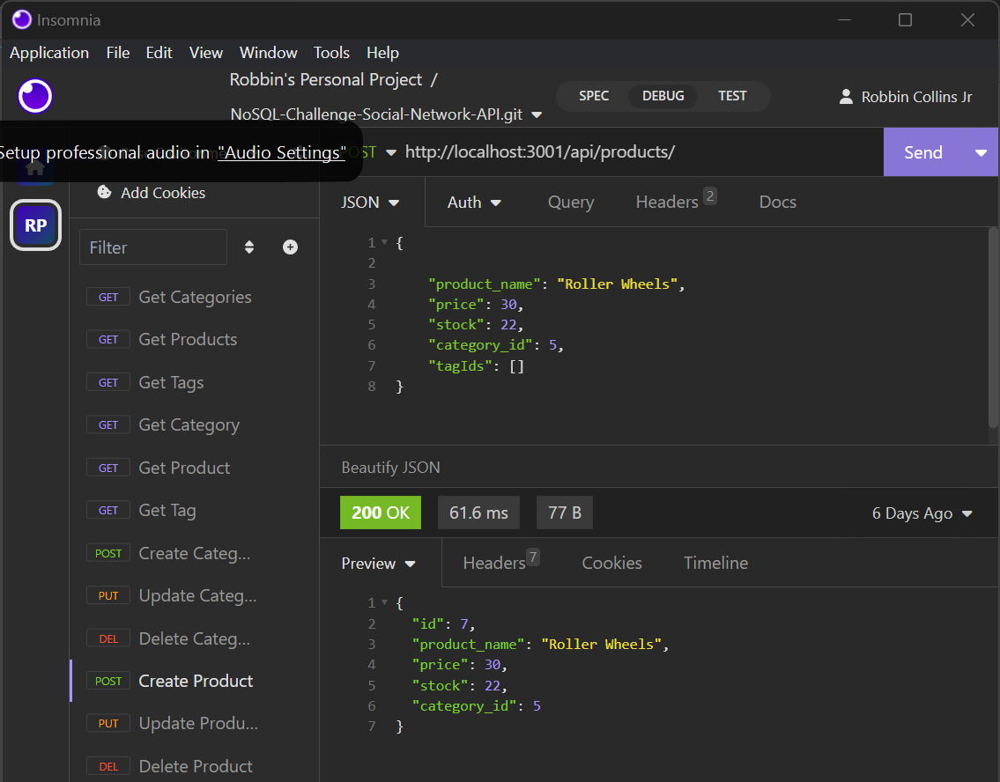

# Robbin E-Comm

## Description
ORM E-Commerce backend site.  It allows to CRUD data in a SQL server.

## Table of Contents
- [Installation](#installation)
- [Usage](#usage)
- [Credits](#credits)
- [License](#license)
- [Features](#features)
- [Tests](#tests)
- [Contact](#contact)

## Installation
sequelize, nodejs, express

## Usage
run 'npm start' in the terminal.

## Credits
Robbin Collins

## Features
It allows the manipulation of data in the backend.

## Tests
verify data was altered in the SQL server.

## Contact
If there are any questions of concerns, I can be reached at:
##### [github: Robbi19](https://github.com/Robbi19)
##### [email: collinsduo1@gmail.com](mailto:collinsduo1@gmail.com)
